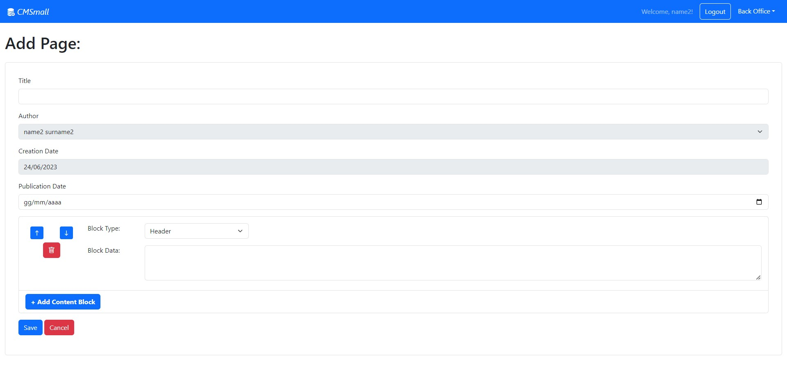
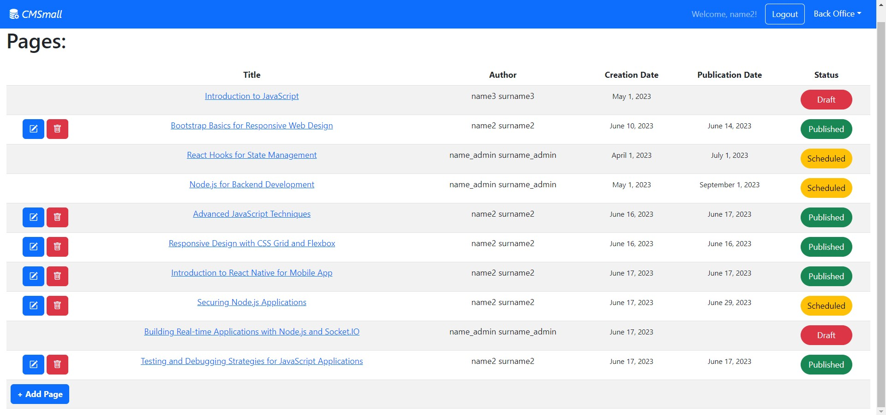

# CMSmall
This is a small frontend project developed during the "Web Application I" exam at Politecnico di Torino.

The focus of the project was to create a small content management system for a website.

In the following document you can find a detailed description of all the components of the web application.

## How to use

The web application is composed of two main parts: the client and the server.
You can find both implementations in the respective folders.

First of all you need to install all the dependencies with the following command:

```bash
cd your_project_directory/client
npm i
```
```bash
cd your_project_directory/server
npm i
```
Once all the dependencies are installed, you can execute the client and the server with the commands:
```bash
cd your_project_directory/client
npm run dev
```

```bash
cd your_project_directory/server
nodemon ./index.js
```

**Note:** you need to have the nodemon package installed _globally_, as it's not an explicit dependency listed in the package.json file.

The application should now run smoothly. You can use it in its basic form, or you can explore the more advanced functionalities doing the login as admin or normal user.

You can find the credentials at the end of this file.

## React Client Application Routes

- Route `/`: website landing page, there is a table of all published pages
- Route `/pages/:id/`: detailed view of a single pages with all its contents. `/:id` is and integer representing the page id
- Route `/back-office/`: back office route. From this page is possible to view all pages (draft, scheduled and published) and create/edit/delete a page
- Route `/back-office/add/`: using this route, the user can access the form to create a new page with its content
- Route `/back-office/pages/:id/edit/`: using this route, the user can access the form to edit an existing page. `/:id` is and integer representing the page id
- Route `/login/`: login page. Only accessible if not already logged in
- All other routes lead to a `Not Found` page

## API Server

- GET `/api/users`:
    - route only accessible by logged-in users
    - Description: retrieve a list of all users
    - Request parameters: _None_
    - Request body: _None_
    - Response: `200 OK` (success)
    - Response body: one object describing all the users:
    ``` JSON
    [
        {
            "id": 3,
            "name": "name 2",
            "surname": "surname 2",
            "username": "test2@example.com",
            "role": 4,
        },
        ...
    ]
    ```
    - Error responses:  `500 Internal Server Error` (generic error)

- POST `/api/sessions`: create a new session for login
    - Description: create a new session
    - Request parameters: _None_
    - Request body:
    ``` JSON
    {
        "email": "test2@example.com",
        "password": "test2",
    }
    ```
    - Response: `201 created` (success)
    - Response body: one object describing the logged users:
    ``` JSON
    {
        "id": 3,
        "name": "name 2",
        "surname": "surname 2",
        "username": "test2@example.com",
        "role": 4,
    }
    ```
    - Error responses:  `401 Unauthorized`

- GET `/api/sessions/current`:
    - route only accessible by logged-in users
    - Description: retrieve the session of a logged-in user
    - Request parameters: _None_
    - Request body: _None_
    - Response: `201 created` (success)
    - Response body:
    ``` JSON
    {
        "id": 3,
        "name": "name 2",
        "surname": "surname 2",
        "username": "test2@example.com",
        "role": 4,
    }
    ```
    - Error responses:  `401 Unauthorized`

- DELETE `/api/session/current`
    - Description: delete session of logged-in user
    - Request parameters: _None_
    - Request body: _None_
    - Response: `200 OK` (success)
    - Response body:

    ``` JSON
    { "message": "logged out successfully" }
    ```
    - Error responses:  `401 Unauthorized`

- GET `/api/pages`
    - Description: get list of published pages if not logged-in, all pages otherwise
    - Request parameters: _None_
    - Request body: _None_
    - Response: `200 OK` (success)
    - Response body: one object describing a list of pages:
    ``` JSON
    [
        {
            "id": 3,
            "title": "Bootstrap Basics for Responsive Web Design",
            "creationDate": "2023-06-10",
            "publicationDate": "2023-06-14",
            "authorName": "name2 surname2"
        },
        ...
    ]
    ```
    - Error responses:  `500 Internal server error`

- GET `/api/pages/:id`
    - Description: get a single page
    - Request parameters: id of the wanted page
    - Request body: _None_
    - Response: `200 OK` (success)
    - Response body: one object describing the requested page:
    ``` JSON
    {
        "id": 3,
        "title": "Bootstrap Basics for Responsive Web Design",
        "creationDate": "2023-06-10",
        "publicationDate": "2023-06-14",
        "authorName": "name2 surname2"
    }
    ```
    - Error responses:  `401 Unauthorized`, `500 Internal server error`

- POST `/api/pages`
    - route only accessible by logged-in users
    - Description: create a page
    - Request parameters: _None_
    - Request body:
    ``` JSON
    {"page": {
                "id": 3,
                "title": "Bootstrap Basics for Responsive Web Design",
                "creationDate": "2023-06-10",
                "publicationDate": "2023-06-14",
                "authorName": "name2 surname2"
            },
    "content": [
                    {
                        "id": 1, 
                        "type": 0, //type can only be 0 = header, 1 = paragraph, 2 = image
                        "data": "test data",
                        "position": 0,
                        "pageId": 1
                    },
                    ...
                ]
    }
    ```
    - Response: `201 created` (success)
    - Response body: one object describing the created page:
    ``` JSON
    {
        "id": 3,
        "title": "Bootstrap Basics for Responsive Web Design",
        "creationDate": "2023-06-10",
        "publicationDate": "2023-06-14",
        "authorName": "name2 surname2"
    }
    ```
    - Error responses: `500 Internal server error`

- PUT `/api/pages/:id`
    - route only accessible by the admin or the author of the page
    - Description: update a page
    - Request parameters: id of the page to modify
    - Request body:
    ``` JSON
    {"page": {
                "id": 3,
                "title": "Bootstrap Basics for Responsive Web Design",
                "creationDate": "2023-06-10",
                "publicationDate": "2023-06-14",
                "authorName": "name2 surname2"
            },
    "content": [
                    {
                        "id": 1, 
                        "type": 0,
                        "data": "test data",
                        "position": 0,
                        "pageId": 1
                    },
                    ...
                ],
    "oldIds": [1, 2, 3, ...]
    }
    ```
    - Response: `201 created` (success)
    - Response body:
    ``` JSON
    { message: "page updated successfully" }
    ```
    - Error responses: `500 Internal server error`

- DELETE `/api/pages/:id`
    - route only accessible by the admin or the author of the page
    - Description: delete a page
    - Request parameters: id of the page to delete
    - Request body: _None_
    - Response: `200 OK` (success)
    - Response body:
    ``` JSON
    { message: "page deleted successfully" }
    ```
    - Error responses: `500 Internal server error`

- GET `/api/pages/:id/contents`
    - Description: get the a list of the content blocks of a page
    - Request parameters: id of the page to get content
    - Request body: _None_
    - Response: `200 OK` (success)
    - Response body:
    ``` JSON
    {
        "content": [
                    {
                        "id": 1, 
                        "type": 0,
                        "data": "test data",
                        "position": 0,
                        "pageId": 1
                    },
                    ...
                ]
    }
    ```
    - Error responses: `500 Internal server error`

- GET `/api/title`
    - Description: get the a title of the website
    - Request parameters: _None_
    - Request body: _None_
    - Response: `200 OK` (success)
    - Response body:
    ``` JSON
    {
        "title": "CMSmall"
    }
    ```
    - Error responses: `500 Internal server error`

- PUT `/api/title`
    - route only accessible by the admin
    - Description: modify the a title of the website
    - Request parameters: _None_
    - Request body: 
    ``` JSON
    {
        "title": "CMSmall"
    }
    ```
    - Response: `201 created` (success)
    - Response body:
    ``` JSON
    {
        "title": "CMSmall"
    }
    ```
    - Error responses: `500 Internal server error`

## Database Tables

- Table `users` - contains:
    - id (integer)
    - email (text)
    - password (hashed - text)
    - salt (text)
    - name (text)
    - surname (text)
    - role (integer)
- Table `title` - contains:
    - title (text)
- Table `page` - contains:
    - id (integer)
    - title (text)
    - creationDate (text)
    - publicationDate (text)
    - authorName (text)
- Table `content` - contains:
    - id (integer)
    - type (integer)
    - data (text)
    - position (integer)
    - pageId (integer)

I translated the 1-Many relation between page and content with a foreign key (pageId) in content table.

## Main React Components

- `App` (in `App.jsx`): Main interface of the website, manages init of webPage and general states passed to child components.
- `LoginForm` (in `Auth.jsx`): Checks credentials and provide a form to login.
- `Navigation` (in `Navigation.jsx`): NavBar with login button and drop down menu to select front/back office once logged-in
- `PageForm` (in `PageForm.jsx`): Renders the form for adding/editing a page.
- `Content` (in `PageForm.jsx`): Renders the list of content blocks with a form for adding/editing a content in the page.
- `PageTable` (in `Pages.jsx`): Renders a table with all the selected (published/not published) pages.
- `PageContent` (in `SinglePage.jsx`): Renders all the information about a page and its content.
- `WebsiteTitle` (in `WebsiteTitle.jsx`): Manages the update of the website title by the admin.
- `FrontOfficeLayout` (in `WebsiteLayout.jsx`): Renders the layout of the front office (uses PageTable).
- `SinglePageLayout` (in `WebsiteLayout.jsx`): Renders the layout of a single page (uses PageContent).
- `BackOfficeLayout` (in `WebsiteLayout.jsx`): Renders the layout of the front office.
- `AddLayout` (in `WebsiteLayout.jsx`): Renders the layout and prepare the form for the creation of a new page (uses PageForm).
- `EditLayout` (in `WebsiteLayout.jsx`): Renders the layout and prepare the form for the update of a page (uses PageForm).

## Screenshot

Create a new page:

All pages list:


## Users Credentials

- User 1 (user without any pages):
    - email: test1@example.com 
    - password: test1
- User 2 (normal user):
    - email: test2@example.com 
    - password: test2
- User 3 (normal user):
    - email: test3@example.com 
    - password: test3
- Admin (admin user):
    - email: admin@example.com 
    - password: admin
